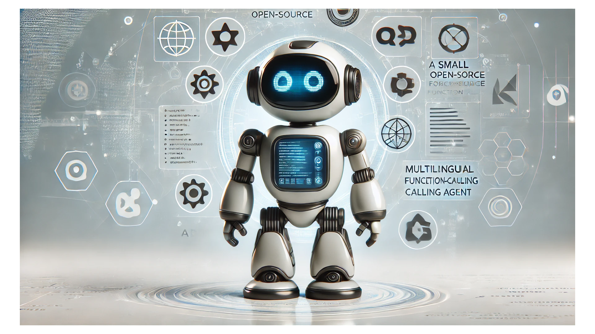

# Small, open-source, multilingual function-calling agent

## Repository Link

[https://github.com/jvonwinckelmann/fine-tuning-course-function-calling-agent]

## Description

The main goal of this project is to more or less replicate the findings of the Octopus v2 paper on a custom created dataset. Octopus v2 showed that with a clever way of creating training data and adding functional tokens it is possible to use small Large Language Models as function-calling agents that perform similar to large LLMs with prompting in choosing the right function and its parameters. Opposed to prompt-based approaches need information on the function definitions in order to perform the tasks a small LLM trained after this approach should in theory be able to generate correct function calls with as little as 30 tokens by performing early stopping before the model generates the function description which is part of the fine-tuning template.

### Task Type

Text Generation / Function-Calling

### Results Summary

- **Best Model:** [german-function-calling-model](https://huggingface.co/fhk-air/german-function-calling-model)
- **Evaluation Metric:** Manual evaluation
- **Result:** Structure is mostly correct, problem with correct dates

## Documentation

1. **[Literature Review](0_LiteratureReview/README.md)**
2. **[Dataset Generation](1_DatasetCharacteristics/DatasetGeneration.ipynb)**
3. **[Baseline Model](2_BaselineModel/README.md)**
4. **[Model Fine-Tuning and Evaluation](3_Model/model_definition_evaluation)**
5. **[Presentation](4_Presentation/README.md)**

## Cover Image

